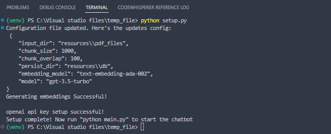
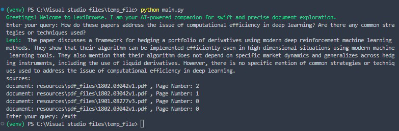

# LexiBrowse - AI Document ChatBot

This is your own personal AI-Powered assistant for swift and precise document exploration. Get precise and quality answers for your questions on the documents. 

## Getting Started

Its recommended to create a virtual environment in order to resolve any version conflicts.\

Follow the below steps:

1. **Create a Virtual Environment:**

   Navigate to the directory where you want to create your virtual environment. Then, run the following command:

   ```
   python3 -m venv venv
   ```

   Replace `venv` with the name you want to give to your virtual environment.
2. **Activate the Virtual Environment:**

   Once you've created a virtual environment, you need to activate it.

   - On Windows, run:

     ```
     venv\Scripts\activate
     ```
   - On Unix or MacOS, run:
     ```
     source venv/bin/activate
     ```
3. **Install Packages:**

   With the virtual environment activated, you can now install packages using pip. I have provided a requirements.txt file to install all the packages you need. Run the following command:

   ```
   pip install -r requirements.txt
   ```
4. **Setting up your OpenAI API KEY**: You have to add the OpenAI API Key in order to use the OpenAI GPT API. Follow the given [link](https://platform.openai.com/account/api-keys) to create one and add it to the .env file.

```
OPENAI_API_KEY='your-api-key-here'
```

5. **Generate and store embeddings:** Execute the `setup.py` file. Make sure you have added the documents to the `input_dir` path specified at the `config.json` file. By default its in the `resources\\pdf_files`. You can also use `python setup.py --help` to learn more.


6. **Start the Chat Interface:** Run the `main.py` file to start the chatbot. This should start the chatbot where you can start chatting by entering the prompt. My chatbot Lexi should give a response along with sources to the document and page numbers. 

## Demo

By default I have added 3 research papers on deep reinforcement learning (something I have been studying to be able to finetune my own model). Check out the below demo:

1. Running the Setup file
```
python setup.py
```


2. Starting the chatbot
```
python main.py
```
